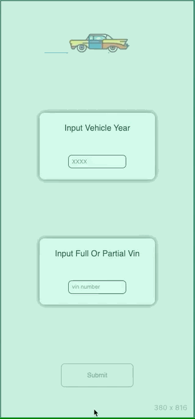
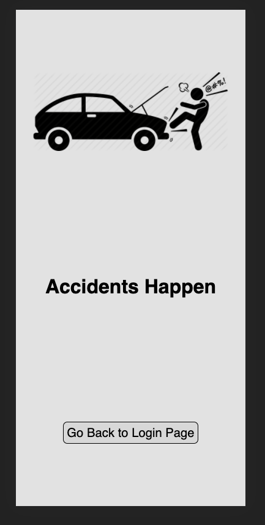
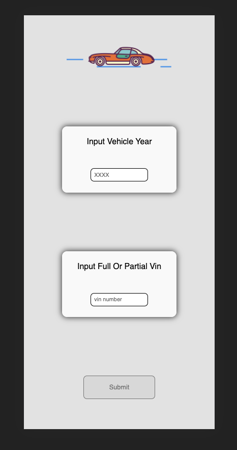
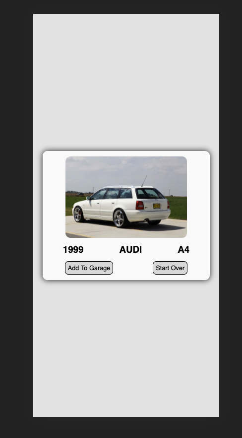
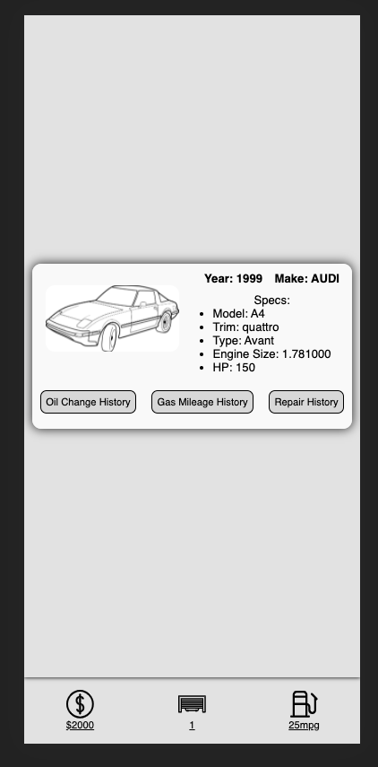
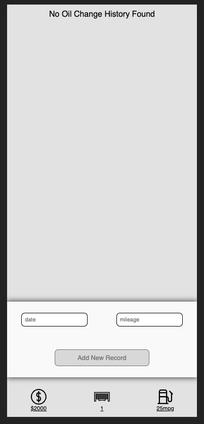
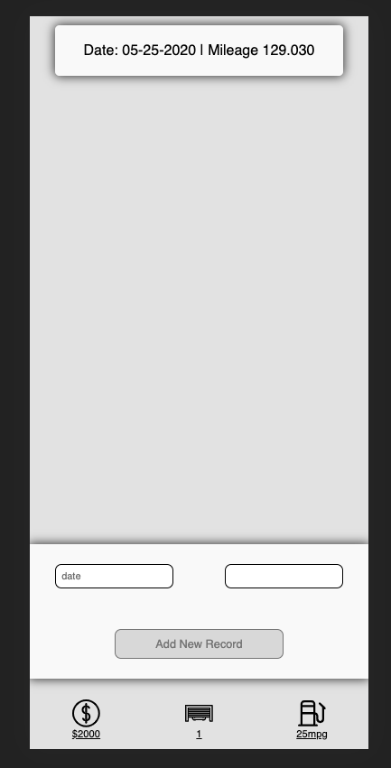
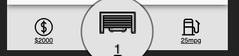

# Dream Garage

## Contributors:
[Taras Tarlov GitHub](https://github.com/ttarlov)

## Abstract

**Technologies Used:**
*React*, *React Router*, *ES6*, *TDD*, *Fetch API for receiving 3rd party data*

Dream Garage is an application I built during my time at [Turing School of Software and Design](http://turing.io). The goal for this project, over the course of 5 days, was to build an application of my choosing using React and React Router. The app had to be fully tested using React Testing Library and Jest. 

**Challenges:**

I had really big plans (I still do) for this app. However with just 5 days my MVP was much simpler than what i hoped it would be. Testing has proven to be much harder especially integration testing. I have gotten much better at it but its still one of my biggest challenges. 

**Future Plans for the App** 

I plan to keep working on this app and add following functionality:

1. Ability to add multiple vehicles to the garage
2. Ability to track fuel economy, and repair history
3. Ability to load document such as insurance information and receipts
4. I would like to build this app in React Native to deploy natively on Android and IOS
5. I would like to build an Arduino based GPS tracker that would integrate into the app 
and allow user to track vehicle location and show it on a map. 

## Setup
1. clone down this repo to desired location
2. `cd` into the new directory
3. run `npm install`
4. run `npm start`
5. Open localhost:3000 in your favorite browser (unless your terminal says otherwise)
6. NOTE: App is built for mobile first. Run with devtool in iphone x screen for best results. 

## Animation 

## 404 Error: 
 Every good webapp should have a fun 404 page:-)

## User Stories :

### User should be able to:

### Start the app by inputting year and vin number for your vehicle.

App is built for mobile first. Run with devtool in iphone x screen for best results. 
 
You can use my Audi as an example 

Year: 1999
Vin: waugb28d9xa015626

### Choose to either add car to garage or restart the process.

### See your garage. 

### See oil change history by clicking "Oil change history. 

### Add new record by filling out data and milage inputs.

### Go back to the garage by clicking garage icon.

